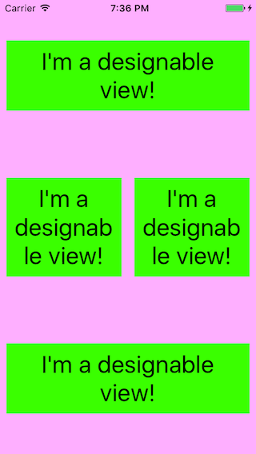

# NestingXibsFun
Demonstration of UIView subclasses with xibs being nested and used in Storyboards.

A few meetups ago our friend Angel asked if custom UIView subclasses/xibs could be used inside Storyboards or nested in other xibs. Our collective answer was "Um... not really?". It turns out we were wrong. The real answer is "Absolutely, with a bit of effort."

Thanks to Angel for asking this question and making me think about it. That's the power of meetups, we all learn even when we *think* we already know the answers.

This code was mostly lifted from: http://stackoverflow.com/questions/30335089/reuse-a-uiview-xib-in-storyboard

### Screenshot

